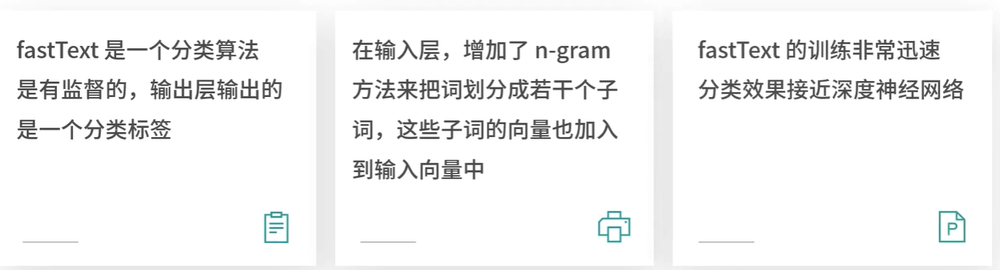
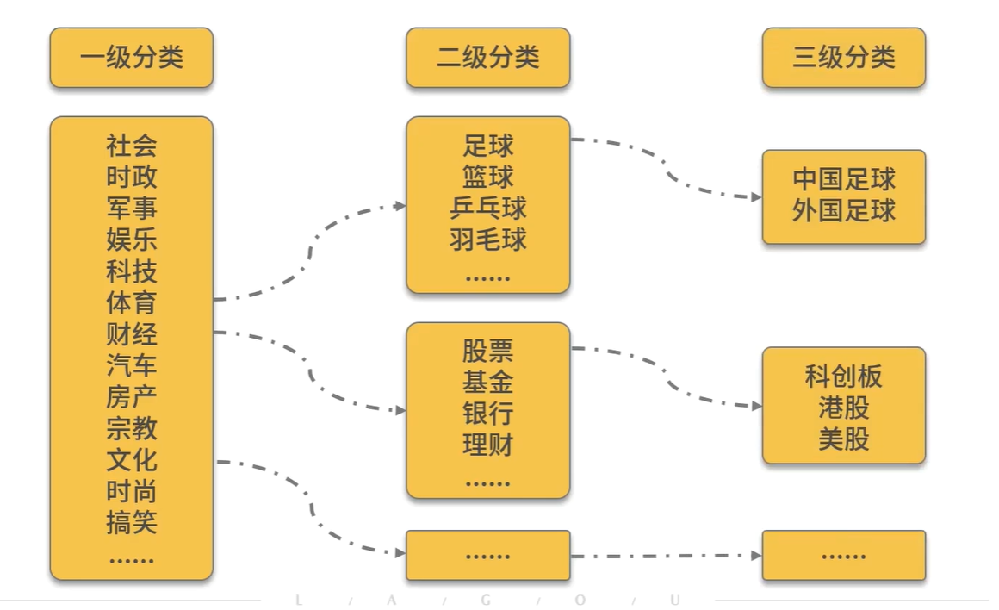
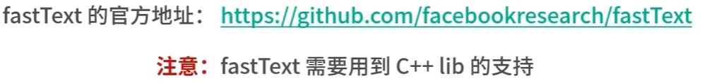
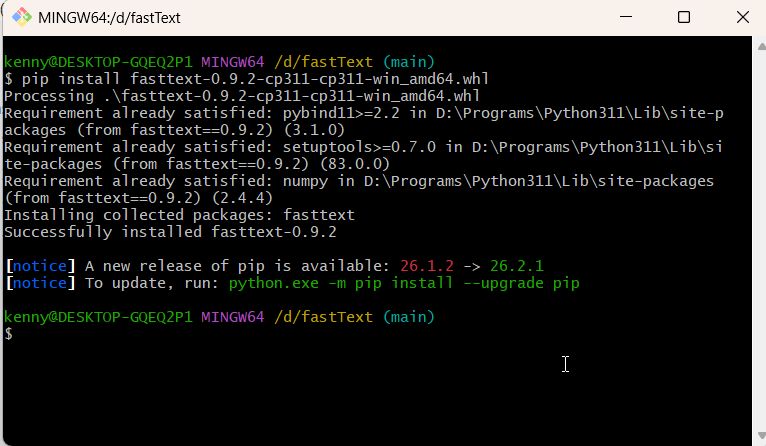
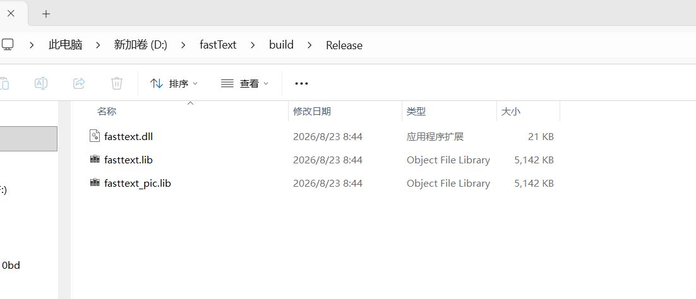
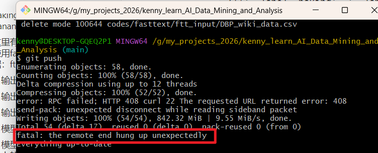

# FastText算法


## 特点



## 逻辑业务与理解数据


## 分类




## 安装FastText： https://github.com/facebookresearch/fastText/tags




## 可以下载fasttext.exe或者使用fastTextpython库

### 1.用下面的命令下载这个库后安装失败

```
 git clone https://github.com/facebookresearch/fastText.git
 cd fastText
 pip install .
```


### 2.然后下载whl文件：https://github.com/mdrehan4all/fasttext_wheels_for_windows/blob/main/fasttext-0.9.2-cp311-cp311-win32.whl

### 3.把他复杂到fastText文件夹里面，然后进入这个文件夹，输入pip install fasttext-0.9.2-cp311-cp311-win32.whl,安装成功




## 虽然此时python的fastText安装成功，但是在scripts文件夹里面并没有fasttext.exe,我们需要这个文件，所以我们需要编译fastText的源码。为了能够利用vs2022来编译，我们需要使用cmake4.4.2来输出项目文件，打开一个cmd窗口进入fastText/build/，输入命令cmake -G "Visual Studio 17 2022" .. -DCMAKE_POLICY_VERSION_MINIMUM=3.5

```
cmake -G "Visual Studio 17 2022" .. -DCMAKE_POLICY_VERSION_MINIMUM=3.5
```


## 执行成功后，再执行下面的命令编译

```
cmake --build . --config Release
```

## 不过此时在Release文件夹里面没有exe文件，



### 其实，我们可用下载fasttext.exe,网址：https://github.com/sigmeta/fastText-Windows/releases/tag/0.9.2


## 怎么办呢，我们还是不要参考这个文档来学习：https://zhuanlan.zhihu.com/p/575814154

### 我们可以使用pip install fasttext-wheel一次安装到位，注意，在使用fasttext的模型进行预测的时候使用model.predict(["Which baking dish is best to bake a banana bread ?"]) 而不是：model.predict("Which baking dish is best to bake a banana bread ?")

### 这里有两个案例，第一个是使用fastText的cooking数据：ftdemo1.ipynb

```python
import fasttext
import re 

# 使文件标点符号与单词分离并统一使用小写字母
def process_text(text):
    # 1. 统一转换为小写
    text = text.lower()
    
    # 2. 在标点符号（如 , . ! ? ; :等）前后自动加上空格，将其与单词分离
    # 该正则匹配所有非字母、非数字、非空白字符的标点
    separated = re.sub(r'([^\w\s])', r' \1 ', text)
    
    # 3. 清理多余的连续空白字符
    cleaned = re.sub(r'\s+', ' ', separated).strip()
    return cleaned

def process_file(input_file,output_file):
    out = open(output_file,'w')
    lines = open(input_file).readlines()
    for line in lines:
        new_line =process_text(line)    
        out.write(new_line+"\n")

   
process_file("./cooking.stackexchange/cooking.stackexchange.txt","./processed_cooking.txt")

def splitData():
    data = open("./processed_cooking.txt",'r').readlines()
    with open("cooking.train","w") as f:
        for i in range(12404):
            f.write(data[i])
    with open("cooking.valid","w") as f:
        for i in range(12404,15404):
            f.write(data[i])

```


```python
# 划分数据集
data = open("./processed_cooking.txt",'r').readlines()
print(len(data))
splitData()
```

    # 输出
    15404
    15404


```python
# 训练模型
# model = fasttext.train_supervised(input="cooking.train",epoch=25,lr=1.0,wordNgrams=2,loss='hs')
model = fasttext.train_supervised(input="cooking.train",epoch=25,lr=0.2,wordNgrams=2,loss='ova') # 损失函数为'ova' lr=1.0会报错
model
```

#### 输出


    <fasttext.FastText._FastText at 0x205c30b2cd0>


```python
# 模型评估
model.predict(["Which baking dish is best to bake a banana bread ?"]) # 预测文本需要放入[]
```

#### 输出


    ([['__label__baking']], [array([1.00001], dtype=float32)])


```python
# 使用验证集
model.test("cooking.valid")
```

#### 输出


    (3000, 0.7123333333333334, 0.3080582384315987)


```python
#  模型保存
model.save_model("D:/fastText_trained_model_and_datas/cocking_model.bin")
```


```python
#加载模型
model2 = fasttext.load_model("D:/fastText_trained_model_and_datas/cocking_model.bin")
model2
```

#### 模型训练成功


    <fasttext.FastText._FastText at 0x205fbb10750>

#### 模型预测，注意写法和网上的写法有点不一样，需要放在[]里面


```python
model.predict(["Which baking dish is best to bake a banana bread ?"], k=-1, threshold=0.5)
```

#### 输出


    ([['__label__baking', '__label__bread', '__label__equipment']],
     [array([1.00001, 1.00001, 1.00001], dtype=float32)])

### 注意，由于模型和一些数据太大，不能够上传到GitHub，我们把它保存在D:/fastText_trained_model_and_datas/中。


### 案例2.ftdemo2.ipynb

### 1.获取数据，点击这个链接即可下载：http://mattmahoney.net/dc/enwik9.zip

### 案例2不好做，我们来学习一个kaggle的例子

### https://www.kaggle.com/code/pawankumargunjan/fasttext/notebook


# 扩展： 这个有一个网址，可以选择数据集

## https://huggingface.co/datasets/fancyzhx/ag_news

# 扩展2：在上传文件到GitHub时，如果出现下面的报错：



## 就需要做下面的配置

```
git config --get http.postBuffer
git config --global http.postBuffer 524288000
```

